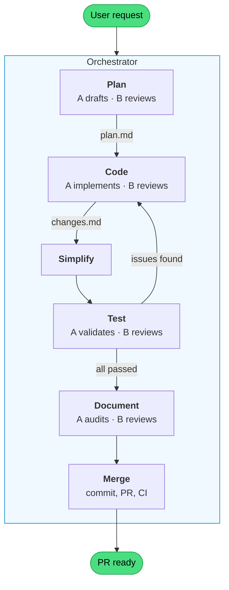

# plantz-claude

A plants watering app used as a proof-of-concept for a **Claude Code agent harness** — a structured setup that lets AI agents scaffold sfeatures.

## What's in this repo

### The application

A pnpm monorepo with Turborepo orchestration and [Squide](https://github.com/gsoft-inc/wl-squide) modules.

```
apps/
  host/                        # Thin shell — bootstraps Squide, no domain logic
  management/
    plants/                    # Management domain module
    storybook/                 # Management domain Storybook + Chromatic
  today/
    landing-page/              # Today domain module
    storybook/                 # Today domain Storybook + Chromatic
  storybook/                   # Packages-layer Storybook
packages/
  components/                  # Shared UI — shadcn/ui (Base UI) + Tailwind v4
  plants-core/                 # Shared plants data layer (MSW handlers, TanStack DB, seed data)
  storybook/                   # Shared Storybook config
```

Each domain is fully isolated — modules never import from each other. Each has its own Storybook and Chromatic token for independent visual regression testing.

### Tech stack

Node 24+, pnpm 10, TypeScript 7 (tsgo), Rsbuild, Vite (Storybooks), Tailwind CSS 4, TanStack DB, Storybook 10, Chromatic, Vitest, Playwright, oxlint, oxfmt, syncpack.

---

## Agent harness

Four pillars make this repo fully agent-driven. Each section links to the implementation files.

### 1. ADLC skills — end-to-end feature development

Six skills that form a complete Agent Development Life Cycle (ADLC). The orchestrator (`/plantz-adlc-orchestrator`) is the sole entry point for feature development — it spawns subagents for each phase and coordinates them through file-based handoffs in `./tmp/runs/[uuid]/`.



| Skill                      | What it does                                                                                                   |
| -------------------------- | -------------------------------------------------------------------------------------------------------------- |
| `plantz-adlc-orchestrator` | Entry point. Generates a run UUID, creates a branch, and runs steps 1-9 sequentially                           |
| `plantz-adlc-plan`         | Drafts a structured technical plan with tagged acceptance criteria (`[static]`, `[visual]`, `[interactive]`)   |
| `plantz-adlc-code`         | Implements the plan or fixes issues. Uses Chrome DevTools MCP for visual feedback while coding                 |
| `plantz-adlc-test`         | Single validation gate — static checks (lint, modules, accessibility) and browser verification of all criteria |
| `plantz-adlc-document`     | Audits agent-docs and CLAUDE.md for drift, creates ADRs/ODRs if new decisions were made                        |
| `plantz-adlc-merge`        | Commits, pushes, opens a PR with strict template, monitors CI. Returns control on failures                     |

Key design decisions:

- **Self-contained**: Plan, code, and test skills each embed their own `references/` files (tech-stack rules, styling conventions, accessibility requirements).
- **Subagent protocol**: Every multi-agent step uses a drafter/reviewer pair (A drafts, B reviews and improves). The orchestrator spawns both — subagents never spawn further subagents.
- **File-based coordination**: All inter-step communication goes through files in `./tmp/runs/[uuid]/`. This makes handoffs explicit and debuggable (see "Run folder artifacts" below).
- **Test as the single gate**: The test skill owns all verification — both static (lint, modules, accessibility) and visual/interactive (browser screenshots via Chrome DevTools MCP). The code skill writes code; the test skill validates it.
- **Acceptance criteria flow**: Plan tags each criterion. Test verifies them and writes results to `changes-*.md`. Merge reads results and populates the PR with pass/fail status.

#### Run folder artifacts

Every ADLC run produces files in `./tmp/runs/[uuid]/` that flow between subagents:

```
./tmp/runs/[uuid]/
  ├─ orchestrator-state.md    # Orchestrator writes after each step (recovery on context compaction)
  ├─ plan.md                  # Plan skill writes → Code, Test, Merge read
  ├─ changes-1.md             # Code writes → Test appends verification results → Merge reads for PR
  ├─ changes-2.md             # (iteration 2, if test found issues)
  ├─ test-issues-1.md         # Test writes (only if failures) → Code reads on next fix iteration
  ├─ escalation-1.md          # Code B writes (only if structural) → Orchestrator judges
  ├─ ci-issues-1.md           # Merge writes (only if CI fails) → Code reads for fix
  └─ failure-summary.md       # Orchestrator writes on unrecoverable failure
```

The folder is deleted on successful completion and preserved on failure for post-mortem.

**Files:** [`.claude/skills/plantz-adlc-*/`](.claude/skills/)

### 2. Guardrails

Hard constraints that skills cannot bypass — enforced at the tool level (hooks) and on every push (CI/CD).

#### Hooks

Shell scripts that run automatically before or after agent tool calls, enforcing architectural rules in real time.

| Hook                                           | Trigger           | What it does                                                        |
| ---------------------------------------------- | ----------------- | ------------------------------------------------------------------- |
| `pre-bash--enforce-pnpm.sh`                    | Before Bash       | Blocks npm/npx — only pnpm allowed                                  |
| `pre-bash--lint-on-commit.sh`                  | Before Bash       | Runs oxlint on staged files before git commit                       |
| `pre-bash--no-file-level-disable-on-commit.sh` | Before Bash       | Rejects file-level `/* oxlint-disable */` comments on commit        |
| `pre-edit--protect-files.sh`                   | Before Edit/Write | Prevents modification of sensitive files                            |
| `pre-edit--module-import-guard.sh`             | Before Edit/Write | Prevents cross-module imports (`@modules/*` packages stay isolated) |
| `post-edit--format.sh`                         | After Edit/Write  | Formats with oxfmt                                                  |
| `post-edit--lint.sh`                           | After Edit/Write  | Lints with oxlint — reports issues immediately                      |

Hook names follow the `{event}--{what}.sh` convention so it's clear at a glance when a hook fires and what it does.

**Files:** [`.claude/hooks/`](.claude/hooks/), [`.claude/settings.json`](.claude/settings.json)

#### Static analysis

Three tools run on every `pnpm lint` and in CI, catching issues before code is merged:

| Tool     | What it enforces                                                                                        |
| -------- | ------------------------------------------------------------------------------------------------------- |
| oxlint   | Fast JS/TS linter — catches bugs, accessibility issues, and perf anti-patterns                          |
| tsgo     | Native TypeScript type checker (`@typescript/native-preview`) — ensures type safety across all packages |
| syncpack | Dependency version consistency — apps pin exact versions, packages use `^` ranges                       |

#### Storybook a11y testing

Every domain Storybook doubles as an automated accessibility test suite in a real Chromium browser (via Playwright).

```bash
pnpm test           # Runs all workspace tests (including Storybook a11y) via Turborepo
```

#### CI/CD

Six GitHub Actions workflows, four of which involve Claude Code:

| Workflow          | Trigger                         | Purpose                                                                   |
| ----------------- | ------------------------------- | ------------------------------------------------------------------------- |
| `ci.yml`          | Push to main, PRs               | Build, lint (oxlint, oxfmt, typecheck, syncpack), test                    |
| `chromatic.yml`   | Push to main, labeled PRs       | Visual regression testing — only affected Storybooks                      |
| `claude.yml`      | `@claude` mention in issues/PRs | Claude Code agent responds to issues and PR comments                      |
| `code-review.yml` | PRs opened/updated              | Automated code review by Claude (read-only tools)                         |
| `smoke-tests.yml` | PRs to main                     | Smoke-tests all apps via Claude (scoped Bash, artifact upload on failure) |

**Files:** [`.github/workflows/`](.github/workflows/), [`.github/prompts/`](.github/prompts/)

### 3. Supporting skills

The ADLC skills don't work alone — they load project-specific utility skills and shared external skills at runtime.

**Utility skills** (prefixed with `plantz-`):

| Skill                              | What it does                                                                                       |
| ---------------------------------- | -------------------------------------------------------------------------------------------------- |
| `plantz-scaffold-domain-module`    | Scaffolds a new Squide module — creates files, registers in host, wires Storybook, adds dev script |
| `plantz-scaffold-domain-storybook` | Scaffolds a domain Storybook with Chromatic CI integration                                         |
| `plantz-audit-agent-docs`          | 3-pass audit of all docs against the live codebase (structural, accuracy, instruction quality)     |
| `plantz-validate-modules`          | Validates every module conforms to the expected structure (12 checks)                              |
| `plantz-smoke-tests`               | Smoke-tests every app by starting dev servers and verifying pages load in a browser                |

Utility skills use a **reference module pattern** — instead of hardcoding dependency versions or configs, they read a canonical reference module (e.g., `apps/management/plants/`) at execution time and clone from it.

**External skills** (symlinked from `.agents/skills/`):

| Skill                           | Loaded by  | Purpose                                  |
| ------------------------------- | ---------- | ---------------------------------------- |
| `workleap-react-best-practices` | plan, code | React SPA performance patterns           |
| `accessibility`                 | plan, code | WCAG 2.1 audit and remediation           |
| `shadcn`                        | plan, code | shadcn/ui component management           |
| `frontend-design`               | plan, code | Production-grade UI design               |
| `workleap-squide`               | plan, code | Squide modular shell conventions         |
| `pnpm`                          | code, test | Workspace dependency management          |
| `turborepo`                     | code, test | Monorepo task orchestration              |
| `vitest`                        | test       | Unit testing                             |
| `workleap-web-configs`          | code       | Shared ESLint/TypeScript/Rsbuild configs |
| `workleap-logging`              | code       | Structured logging                       |

**Files:** [`.claude/skills/`](.claude/skills/), [`.agents/skills/`](.agents/skills/)

### 4. ADRs and ODRs (decision logs)

Formal logs of _why_ decisions were made — not just what was decided. Agents check these before making changes to prevent contradictory work. The `plantz-adlc-document` skill creates new records when implementation introduces new architectural or operational decisions.

| Record   | Decision                                                        |
| -------- | --------------------------------------------------------------- |
| ADR-0001 | Squide federated modules as the application shell               |
| ADR-0002 | Domain-scoped Storybooks for independent visual testing         |
| ODR-0001 | pnpm workspaces + Turborepo for package management              |
| ODR-0002 | Dependency versioning via syncpack (apps pin, packages use `^`) |
| ODR-0003 | Selective Chromatic runs — only test affected Storybooks        |
| ODR-0004 | JIT packages — no pre-build needed for dev                      |

**Files:** [`agent-docs/adr/`](agent-docs/adr/), [`agent-docs/odr/`](agent-docs/odr/)

---

### Other notable patterns

**Selective Chromatic runs** — a custom TypeScript utility ([`scripts/getAffectedStorybooks.ts`](scripts/getAffectedStorybooks.ts)) that detects which Storybooks were affected by code changes. Unaffected Storybooks skip their Chromatic build entirely.

**Instruction authoring principles** — a framework for writing agent instructions that actually get followed. Key insight: agents ignore advisory framing ("you should...") but follow prohibition framing ("never..."). See [`agent-docs/references/writing-agent-instructions.md`](agent-docs/references/writing-agent-instructions.md).

---

## Getting started

### Prerequisites

- Node.js 24+
- pnpm 10+

### Install

```bash
pnpm install
```

### Seed data

Plant data lives in an MSW in-memory database. Data resets on every reload — no manual seeding needed.

### Run the app

```bash
pnpm dev-host                  # Full app — all modules (http://localhost:8080)
pnpm dev-management-plants     # Just the plants module
pnpm dev-today-landing-page    # Just the today module
```

To load specific modules manually:

```bash
cross-env MODULES=management/plants pnpm dev-host
```

### Run Storybooks

```bash
pnpm dev-packages-storybook      # Shared components (http://localhost:6006)
pnpm dev-management-storybook    # Management domain
pnpm dev-today-storybook         # Today domain
```

### Run checks

```bash
pnpm lint          # ESLint (per-package, via Turborepo)
pnpm test          # Storybook a11y tests (Vitest + Playwright, via Turborepo)
pnpm oxlint        # oxlint (custom config in oxlintrc.json)
pnpm oxfmt         # Formatter check (oxfmt with Tailwind class sorting)
pnpm typecheck     # TypeScript (tsgo)
pnpm syncpack      # Dependency version consistency
```
