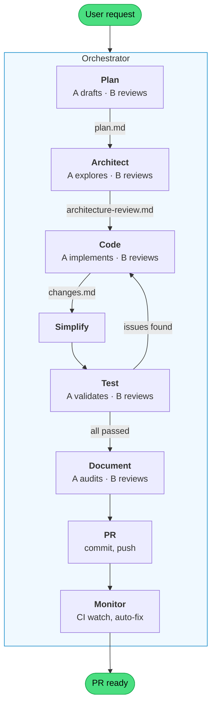

# plantz-claude

A plants watering app used as a proof-of-concept for a **Claude Code agent harness** — a structured setup that lets AI agents scaffold sfeatures.

:point_right: App: https://plantz-claude-storybook.netlify.app/

:point_right: Storybook: https://plantz-claude-storybook.netlify.app/

## What's in this repo

### The application

A pnpm monorepo with Turborepo orchestration and [Squide](https://github.com/gsoft-inc/wl-squide) modules.

```
apps/
  host/                        # Thin shell — bootstraps Squide, no domain logic
  management/
    plants/                    # Management domain module
    user/                      # User profile module
    storybook/                 # Management domain Storybook + Chromatic
  today/
    landing-page/              # Today domain module
    storybook/                 # Today domain Storybook + Chromatic
  storybook/                   # Packages-layer Storybook
packages/
  components/                  # Shared UI — shadcn/ui (Base UI) + Tailwind v4
  core-module/                 # Cross-module infrastructure — session, auth, app shell
  core-plants/                 # Shared plants data layer (MSW handlers, TanStack DB, seed data)
  storybook/                   # Shared Storybook config
```

Each domain is fully isolated — modules never import from each other. Each has its own Storybook and Chromatic token for independent visual regression testing.

### Tech stack

Node 24+, pnpm 10, TypeScript 7 (tsgo), Rsbuild, Vite (Storybooks), Tailwind CSS 4, TanStack DB, Storybook 10, Chromatic, Vitest, Playwright, oxlint, oxfmt, syncpack, knip, gitleaks.

---

## Agent harness

Four pillars make this repo fully agent-driven. Each section links to the implementation files.

### 1. ADLC skills — end-to-end feature development

Eight skills that form a complete Agent Development Life Cycle (ADLC). Two flows:

**New feature** — run the orchestrator locally with a feature request. It creates a branch, spawns subagents for each phase (plan, architect, code, simplify, test, document, PR, monitor), opens a PR, and monitors CI.

```
/plantz-adlc-orchestrator Add a vacation planner page with date picker and delegation support
```

**Revise a feature** — on the PR branch, run the orchestrator with `--revise` to apply feedback through the full ADLC pipeline (plan revision, code, test, document, push).

```
/plantz-adlc-orchestrator --revise "restructure the data layer to use TanStack DB" --previous-run-uuid abc123
```

The `--previous-run-uuid` is shown in the PR description footer. For lightweight fixes, comment `@claude /fix <feedback>` directly on the PR instead — the Claude workflow applies the fix, runs tests, and pushes.

All inter-step coordination goes through files in `.adlc/[uuid]/`.



| Skill                      | What it does                                                                                                   |
| -------------------------- | -------------------------------------------------------------------------------------------------------------- |
| `plantz-adlc-orchestrator` | Entry point. Generates a run UUID, creates a branch, and runs steps 1-10 sequentially                          |
| `plantz-adlc-plan`         | Drafts a structured technical plan with tagged acceptance criteria (`[static]`, `[visual]`, `[interactive]`)   |
| `plantz-adlc-architect`    | Explores codebase for friction, designs interface contracts, classifies dependency boundaries, assesses depth  |
| `plantz-adlc-code`         | Implements the plan or fixes issues. Uses Chrome DevTools MCP for visual feedback while coding                 |
| `plantz-adlc-test`         | Single validation gate — static checks (lint, modules, accessibility) and browser verification of all criteria |
| `plantz-adlc-document`     | Audits agent-docs and CLAUDE.md for drift, creates ADRs/ODRs if new decisions were made                        |
| `plantz-adlc-pr`           | Commits, pushes, and opens a PR. Returns the PR number for the monitor skill                                   |
| `plantz-adlc-monitor`      | Monitors CI workflows (Phase 1 core + Phase 2 Chromatic), auto-fixes failures, adds `run chromatic` label      |

Key design decisions:

- **Shared references**: Tech-stack rules (Tailwind, Storybook, shadcn, MSW, color mode) live in `agent-docs/references/` as a single source of truth. Each ADLC skill explicitly lists which references it reads — no duplication, no drift.
- **Subagent protocol**: Every multi-agent step uses a drafter/reviewer pair (A drafts, B reviews and improves). The orchestrator spawns both — subagents never spawn further subagents.
- **File-based coordination**: All inter-step communication goes through files in `.adlc/[uuid]/`. This makes handoffs explicit and debuggable (see "Run folder artifacts" below).
- **Test as the single gate**: The test skill owns all verification — both static (lint, modules, accessibility) and visual/interactive (browser screenshots via Chrome DevTools MCP). The code skill writes code; the test skill validates it.
- **Acceptance criteria flow**: Plan tags each criterion. Test verifies them and writes results to `changes-*.md`. The PR skill reads results and populates the PR with pass/fail status. See [Acceptance criteria flow](#acceptance-criteria-flow) below.

#### Acceptance criteria flow

Every PR carries a machine-verified checklist proving the change works — visible directly in the PR body so reviewers don't have to manually verify behavior.

**1. Plan** — The plan skill writes acceptance criteria in `plan.md`. Each criterion is tagged by how it will be verified:

| Tag             | Verified by                                    |
| --------------- | ---------------------------------------------- |
| `[static]`      | Lint, typecheck, module validation             |
| `[visual]`      | Launching the app and inspecting a screenshot  |
| `[interactive]` | Clicking, typing, or navigating in the browser |

Criteria must be specific enough for an agent with Chrome DevTools to verify (e.g., "dialog has readable text on dark background", not "dark mode looks good").

**2. Test** — The test skill runs static checks first, then opens a browser to verify `[visual]` and `[interactive]` criteria via screenshots and interaction. If anything fails, the orchestrator loops back to the code skill (up to 5 iterations) until all criteria pass.

**3. PR** — The PR skill publishes the final pass/fail results into the PR body:

```markdown
## Verified acceptance criteria

- ✅ `[static]` Types compile with no errors
- ✅ `[visual]` Delete button has white text on red background
- ✅ `[interactive]` Pressing Escape closes the modal
```

#### Escalation process

Sometimes a plan's approach is structurally wrong — no amount of code iteration can fix it. The escalation process handles this.

Only the reviewing subagent (B) can escalate — never the drafter. This separation prevents the agent that wrote the code from vetoing its own plan. B writes an escalation file describing the problem, evidence, and a proposed alternative. The orchestrator then judges whether the issue is genuinely structural or whether the reviewer is being overly cautious. If justified, the plan is revised and implementation restarts from scratch. If rejected, the run continues normally and the rejected escalation is carried forward as context to prevent the same concern from resurfacing.

A maximum of one plan revision is allowed per run — the system fails fast rather than entering an endless redesign loop.

#### Run folder artifacts

Every ADLC run produces files in `.adlc/[uuid]/` that flow between subagents:

```
.adlc/[uuid]/
  ├─ plan.md                  # Plan skill writes → Architect, Code, Test, PR read
  ├─ architecture-review.md   # Architect writes → Code reads for interface contracts
  ├─ changes-1.md             # Code writes → Test appends verification results → PR skill reads
  ├─ changes-2.md             # (iteration 2, if test found issues)
  ├─ test-issues-1.md         # Test writes (only if failures) → Code reads on next fix iteration
  ├─ escalation-1.md          # Code B writes (only if structural) → Orchestrator judges
  └─ failure-summary.md       # Orchestrator writes on unrecoverable failure
```

**Files:** [`.claude/skills/plantz-adlc-*/`](.claude/skills/)

### 2. Guardrails

Hard constraints that skills cannot bypass — enforced at the tool level (hooks) and on every push (CI/CD).

#### Hooks

Shell scripts that run automatically before or after agent tool calls, enforcing architectural rules in real time.

| Hook                                           | Trigger           | What it does                                                              |
| ---------------------------------------------- | ----------------- | ------------------------------------------------------------------------- |
| `pre-bash--enforce-pnpm.sh`                    | Before Bash       | Blocks npm/npx — only pnpm allowed                                        |
| `pre-bash--lint-on-commit.sh`                  | Before Bash       | Runs oxlint on staged files before git commit                             |
| `pre-bash--no-file-level-disable-on-commit.sh` | Before Bash       | Rejects file-level `/* oxlint-disable */` comments on commit              |
| `pre-bash--secret-scan.sh`                     | Before Bash       | Runs gitleaks on staged files before git commit — catches secrets         |
| `pre-edit--protect-files.sh`                   | Before Edit/Write | Prevents modification of sensitive files                                  |
| `pre-edit--module-import-guard.sh`             | Before Edit/Write | Enforces architectural layering — blocks forbidden imports between layers |
| `post-edit--format.sh`                         | After Edit/Write  | Formats with oxfmt                                                        |
| `post-edit--lint.sh`                           | After Edit/Write  | Lints with oxlint — reports issues immediately                            |

Hook names follow the `{event}--{what}.sh` convention so it's clear at a glance when a hook fires and what it does.

**Files:** [`.claude/hooks/`](.claude/hooks/), [`.claude/settings.json`](.claude/settings.json)

#### Static analysis

Five tools run on every `pnpm lint` and in CI, catching issues before code is merged:

| Tool     | What it enforces                                                                                        |
| -------- | ------------------------------------------------------------------------------------------------------- |
| oxlint   | Fast JS/TS linter — catches bugs, accessibility issues, and perf anti-patterns                          |
| tsgo     | Native TypeScript type checker (`@typescript/native-preview`) — ensures type safety across all packages |
| syncpack | Dependency version consistency — apps pin exact versions, packages use `^` ranges                       |
| knip     | Dead code detection — unused files, unused/unlisted dependencies, unused exports                        |
| gitleaks | Secret scanning — detects API keys, tokens, and credentials before they enter git history               |

#### Bundle budgets

[size-limit](https://github.com/ai/size-limit) enforces gzipped bundle size budgets per app. Budgets are defined in each app's `.size-limit.json` and checked in CI after every build. Agents that exceed a budget must optimize before increasing it — see [ODR-0006](agent-docs/odr/0006-bundle-budgets-size-limit.md) for the full policy.

```bash
pnpm sizecheck      # Check bundle size budgets
```

#### Storybook a11y testing

Every domain Storybook doubles as an automated accessibility test suite in a real Chromium browser (via Playwright).

```bash
pnpm test           # Runs all workspace tests (including Storybook a11y) via Turborepo
```

#### CI/CD

Seven GitHub Actions workflows, four of which involve Claude Code:

| Workflow          | Trigger                   | Purpose                                                                               |
| ----------------- | ------------------------- | ------------------------------------------------------------------------------------- |
| `ci.yml`          | Push to main, PRs         | Secret scan, build, size-limit, lint (oxlint, oxfmt, typecheck, syncpack, knip), test |
| `lighthouse.yml`  | Push to main, PRs         | Lighthouse CI — performance gate (error below 0.5, 3 runs, median)                    |
| `chromatic.yml`   | Push to main, labeled PRs | Visual regression testing — only affected Storybooks                                  |
| `claude.yml`      | `@claude` in issues/PRs   | Claude Code agent — general assistance and `/fix` iteration                           |
| `code-review.yml` | PRs opened/updated        | Automated code review by Claude (read-only tools)                                     |
| `smoke-tests.yml` | PRs to main               | Smoke-tests all apps via Claude (scoped Bash, artifact upload on failure)             |

**Files:** [`.github/workflows/`](.github/workflows/), [`.github/prompts/`](.github/prompts/)

### 3. Supporting skills

The ADLC skills don't work alone — they load project-specific utility skills and shared external skills at runtime.

**Utility skills** (prefixed with `plantz-`):

| Skill                              | What it does                                                                                       |
| ---------------------------------- | -------------------------------------------------------------------------------------------------- |
| `plantz-scaffold-domain-module`    | Scaffolds a new Squide module — creates files, registers in host, wires Storybook, adds dev script |
| `plantz-scaffold-domain-storybook` | Scaffolds a domain Storybook with Chromatic CI integration                                         |
| `plantz-audit-agent-docs`          | 3-pass audit of all docs against the live codebase (structural, accuracy, instruction quality)     |
| `plantz-validate-modules`          | Validates every module conforms to the expected structure (12 checks)                              |
| `plantz-smoke-tests`               | Smoke-tests every app by starting dev servers and verifying pages load in a browser                |

Utility skills use a **reference module pattern** — instead of hardcoding dependency versions or configs, they read a canonical reference module (e.g., `apps/management/plants/`) at execution time and clone from it.

**External skills** (symlinked from `.agents/skills/`):

| Skill                           | Loaded by             | Purpose                                  |
| ------------------------------- | --------------------- | ---------------------------------------- |
| `workleap-react-best-practices` | plan, code            | React SPA performance patterns           |
| `accessibility`                 | plan, code            | WCAG 2.1 audit and remediation           |
| `shadcn`                        | plan, code            | shadcn/ui component management           |
| `frontend-design`               | plan, code            | Production-grade UI design               |
| `workleap-squide`               | plan, code, architect | Squide modular shell conventions         |
| `pnpm`                          | code                  | Workspace dependency management          |
| `turborepo`                     | code, test            | Monorepo task orchestration              |
| `vitest`                        | test                  | Unit testing                             |
| `workleap-web-configs`          | plan, code            | Shared ESLint/TypeScript/Rsbuild configs |
| `workleap-logging`              | plan, code            | Structured logging                       |

**Files:** [`.claude/skills/`](.claude/skills/), [`.agents/skills/`](.agents/skills/)

### 4. ADRs and ODRs (decision logs)

Formal logs of _why_ decisions were made — not just what was decided. Agents check these before making changes to prevent contradictory work. The `plantz-adlc-document` skill creates new records when implementation introduces new architectural or operational decisions.

| Record   | Decision                                                        |
| -------- | --------------------------------------------------------------- |
| ADR-0001 | Squide federated modules as the application shell               |
| ADR-0002 | Domain-scoped Storybooks for independent visual testing         |
| ODR-0001 | pnpm workspaces + Turborepo for package management              |
| ODR-0002 | Dependency versioning via syncpack (apps pin, packages use `^`) |
| ODR-0003 | Selective Chromatic runs — only test affected Storybooks        |
| ODR-0004 | JIT packages — no pre-build needed for dev                      |
| ODR-0005 | Knip for dead code detection in the lint pipeline               |

**Files:** [`agent-docs/adr/`](agent-docs/adr/), [`agent-docs/odr/`](agent-docs/odr/)

---

### Other notable patterns

**Selective Chromatic runs** — a custom TypeScript utility ([`scripts/getAffectedStorybooks.ts`](scripts/getAffectedStorybooks.ts)) that detects which Storybooks were affected by code changes. Unaffected Storybooks skip their Chromatic build entirely.

**Instruction authoring principles** — a framework for writing agent instructions that actually get followed. Key insight: agents ignore advisory framing ("you should...") but follow prohibition framing ("never..."). See [`agent-docs/references/writing-agent-instructions.md`](agent-docs/references/writing-agent-instructions.md).

---

## Getting started

### Prerequisites

- Node.js 24+
- pnpm 10+

### Install

```bash
pnpm install
```

### Seed data

Plant data lives in an MSW in-memory database. Data resets on every reload — no manual seeding needed.

### Run the app

```bash
pnpm dev-host                  # Full app — all modules (http://localhost:8080)
pnpm dev-management-plants     # Just the plants module
pnpm dev-today-landing-page    # Just the today module
```

To load specific modules manually:

```bash
cross-env MODULES=management/plants pnpm dev-host
```

### Run Storybooks

```bash
pnpm dev-packages-storybook      # Shared components (http://localhost:6006)
pnpm dev-management-storybook    # Management domain
pnpm dev-today-storybook         # Today domain
```

### Run checks

```bash
pnpm lint          # ESLint (per-package, via Turborepo)
pnpm test          # Storybook a11y tests (Vitest + Playwright, via Turborepo)
pnpm oxlint        # oxlint (custom config in oxlintrc.json)
pnpm oxfmt         # Formatter check (oxfmt with Tailwind class sorting)
pnpm typecheck     # TypeScript (tsgo)
pnpm syncpack      # Dependency version consistency
pnpm knip          # Dead code detection (unused files, deps, exports)
pnpm sizecheck     # Bundle size budgets
```
